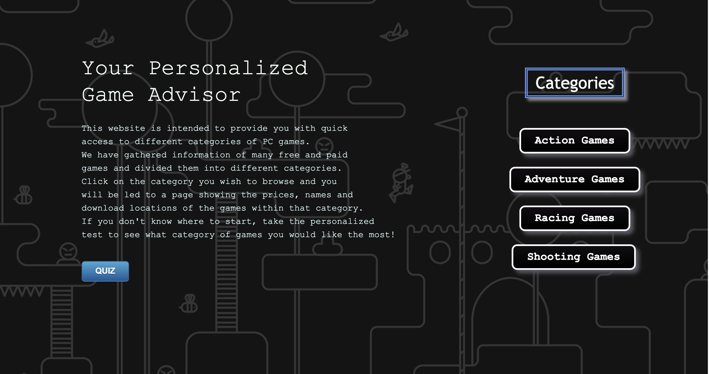

# game-advisor  
Written by: Mingyu Liu, Zimeng Wang, Xintong Li, Jiaying Cui  

A website that tests your preferences and connects you to different categories of PC games. 

The website is intended to provide you with quick access to different categories of PC games. 
We have gathered information of many free and paid games and divided them into different categories.  

Click on the category you wish to browse on the right and you will be led to a page showing the 
prices, names and download locations of the games within that category.  

If you don't know where to start, take the personalized quiz to see what category of games you would like the most!   

The website is super user-friendly. 
Click on the buttons and texts and you will be directed to the corresponding pages.  

